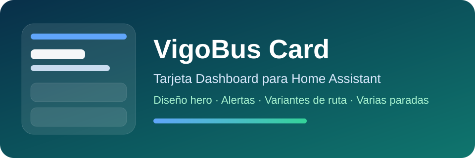

# VigoBus Card



Dashboard card for Home Assistant that displays VigoBus and Vitrasa arrival times, routes, alerts, and multiple configured stops.
## Features

- Main stop hero layout
- Secondary stops with matching style
- Route-aware upcoming buses
- Multiple route variants shown per line when available
- Alerts per active line
- Spanish, English, and Galician UI
- Compact mode and card editor

## Installation with HACS

1. Open HACS.
2. Add a custom repository.
3. Use the repository URL for this card.
4. Select the category `Dashboard`.
5. Install `VigoBus Card`.

## Resource

If HACS does not add the resource automatically, add:

`/hacsfiles/lovelace-vigobus-card/vigobus-card.js`

## Example

```yaml
type: custom:vigobus-card
title: VigoBus
show_alerts: true
show_all_stops: true
```
